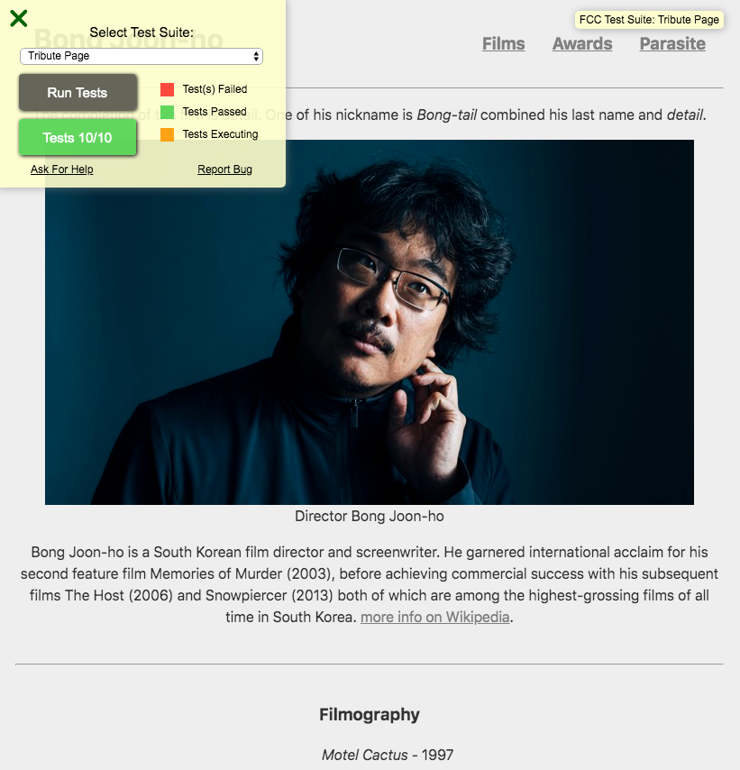

# Responsive Web Design Projects

## Build a Tribute Page

### Objective
Build a CodePen app that is functionally similar to this [https://codepen.io/freeCodeCamp/full/zNqgVx](https://codepen.io/freeCodeCamp/full/zNqgVx).

Fullfill a [user story](https://en.wikipedia.org/wiki/User_story) and get all of the [tests](https://www.freecodecamp.org/learn/responsive-web-design/responsive-web-design-projects/build-a-tribute-page) to pass.

Use HTML, JavaScript, and (plain) CSS to complete this project.

### User story
In software development and product management, a user story is an informal, natural language description of one or more features of a software system. User stories are often written from the perspective of an end user or user of a system.

- **User story #1** : My tribute page should have an element with a corresponding `id="main"`, which contains all other elements.

- **User story #2** : I should see an element with a corresponding `id="title"`, which contains a string (i.e. text) that describes the subject of the tribute page.

- **User story #3** : I Should see a `div` element with a corresponding `id="img-div"`.

- **User story #4** : Within the `img-div` element, I should see an `img` element with a corresponding `id="image"`.

- **User story #5** : Within the `img-div` element, I should see an element with a corresponding `id="img-caption"` that contains textual content describing the image shown in `img-div`.

- **User story #6** : I should see an element with a corresponding `id="tribute-info"`, which contains textual content describing the subject of the tribute page.

- **User story #7** : I should see an `a` element with a corresponding `id="tribute-link"`, which links to an outside site that contains additional information about the subject of the tribute page. HINT: You must give your element an attribute of target and set it to _blank in order for your link to open in a new tab (i.e. `target="_blank"`).

- **User story #8** : The `img` element should responsively resize, relative to the width of its parent element, without exceeding its original size.

- **User story #9** : The `img` element should be centered within its parent element.

### Strecth goals
- Deployment : Use Netlify or GitHub myPage
- Header navigation function : Click nav item from the nav bar, page scroll down -- can make fixed nar bar later

### Snapshot
- Pass ten tests from [codepen](https://codepen.io/areumjo/pen/YzPoNOY)

- Screenshot of the Tribute Webpage
  - 